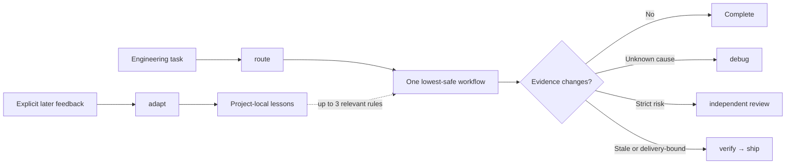

# LeanPowers

**Lightweight, high-rigor engineering workflows for Codex and Claude Code.**

*Essential workflows. Less ceremony.*

[简体中文](README.zh-CN.md) · [Superpowers comparison](docs/comparison-superpowers.md) · [Benchmark protocol](docs/benchmark.md) · [Acknowledgments](ACKNOWLEDGMENTS.md) · [Migration guide](docs/migration.md)

LeanPowers keeps the safeguards that matter—bounded requirements, regression evidence, root-cause debugging, independent review, current verification, and safe delivery—while selecting the smallest workflow justified by risk. It is a workflow microkernel, not a large always-on prompt or orchestration service.

> **Release status:** `0.2.0` is a technical preview with dynamic risk routing and opt-in project learning. Paired live benchmark reports and audits are published transparently; see the [latest result](docs/benchmarks/development-effects-performance-confirmatory-v7-2026-07-16.md), [post-run audit](docs/benchmarks/development-effects-performance-confirmatory-v7-audit-2026-07-16.md), and [benchmark protocol](docs/benchmark.md).

> **Lineage and thanks:** [Superpowers](https://github.com/obra/superpowers) is the upstream reference and principal engineering foundation for this independent project. Its evidence-first engineering discipline, TDD, systematic debugging, review, verification, and safe-delivery ideas made LeanPowers possible. LeanPowers carries those principles into a smaller, risk-adaptive control surface; the comparison is a lineage-and-tradeoff study. See [Acknowledgments](ACKNOWLEDGMENTS.md).

## Why LeanPowers

- Learns from explicit follow-up feedback and applies only the most relevant project lessons next time.
- Selects one lowest-safe workflow dynamically instead of preloading a long mandatory chain.
- Six focused engineering workflows, coordinated by the small `route` and `adapt` control Skills.
- `lean`, `standard`, and `strict` paths selected by observable risk.
- Single-agent execution by default; bounded subagents only for independent work.
- Current evidence required before completion or delivery claims.
- Static installed packages with no MCP server, daemon, telemetry, or third-party dependency installation.
- Native packages for both Codex and Claude Code, plus portable Agent Skills.

## Learn and evolve with your project

LeanPowers has an opt-in, project-local feedback loop. When a later message explicitly says that a previous result worked or failed, corrects an earlier conclusion, or states a durable project preference, `adapt` turns that feedback into one narrow reusable lesson. A future relevant workflow can then retrieve up to three lessons matched by workflow, path, and tags, incorporating relevant project context without loading a growing conversation history.

```text
Enable LeanPowers learning for this project.

"The earlier cache fix failed because tenant scope was checked too late."
→ adapt records a scoped correction for the relevant code and workflow.

"That retry policy worked in production. Keep it for this client."
→ adapt records or reinforces a durable project rule.
```

Additional distinct support reinforces an existing lesson; an explicit correction can supersede an obsolete one. Lessons may expire, and you can inspect, forget, clear, disable, or permanently delete them. Silence, thanks, ordinary continuation, one-time authorization, and the Agent's own self-assessment are never treated as learning evidence.

Learning is disabled by default. When enabled, the bundled Node.js helper stores a project-local `.leanpowers/` ledger and adds it only to Git's local `info/exclude`; it never edits the tracked `.gitignore`. The ledger contains normalized rules and bounded evidence summaries—not raw chats, full prompts, command logs, stack traces, secrets, credentials, or unrelated repository content.

Retrieved lessons are advisory and can never lower authorization, scope, risk, root-cause, regression-evidence, independent-review, or completion-evidence gates. There is no background activity, network access, telemetry, global user profile, or cross-project sharing. Node.js 20+ is needed only after learning is explicitly enabled.

## A dynamic workflow, not a fixed pipeline

`route` reads the task and observable risk, then activates exactly one owning workflow. LeanPowers transitions only when new evidence requires it: an unknown cause moves work to `debug`, strict risk adds independent review, and stale or delivery-bound evidence moves through `verify` before `ship`. The full chain is never loaded by default.



## Install from GitHub

The repository is its own marketplace. Install it directly—no clone is required.

### Codex

```bash
codex plugin marketplace add LAwLi3tCoding/LeanPowers
codex plugin add leanpowers@leanpowers
```

Codex uses native skill discovery and receives no startup prompt injection.

### Claude Code

```bash
claude plugin marketplace add LAwLi3tCoding/LeanPowers
claude plugin install leanpowers@leanpowers
```

The equivalent commands inside an interactive Claude Code session are:

```text
/plugin marketplace add LAwLi3tCoding/LeanPowers
/plugin install leanpowers@leanpowers
```

Claude Code receives one compact, read-only `SessionStart` routing charter. The hook does not scan or write the repository, access the network, or dispatch agents.

## Quick start

LeanPowers can route from the task, or you can invoke a skill explicitly.

```text
# Codex
$leanpowers:route Choose the lightest safe workflow for this engineering task.
$leanpowers:build mode=lean Add the missing validation and its regression test.
$leanpowers:debug The integration test is intermittently returning an empty result.
$leanpowers:verify Prove this branch is ready to deliver.
$leanpowers:adapt Enable LeanPowers learning for this project.

# Claude Code
/leanpowers:route Choose the lightest safe workflow for this engineering task.
/leanpowers:shape mode=standard Design a backward-compatible pagination change.
/leanpowers:review Review this diff against the stated acceptance criteria.
/leanpowers:ship Push the verified branch and open the requested pull request.
/leanpowers:adapt What has LeanPowers learned in this project?
```

`mode=auto` is the default. `mode=lean`, `mode=standard`, and `mode=strict` request a workflow preference; safety, authorization, scope, and evidence gates can still raise the rigor.

## The six engineering workflows

| Skill | Use it for | Primary output |
| --- | --- | --- |
| `shape` | Material ambiguity, scope, architecture, acceptance criteria | Executable brief with 1–5 delivery slices |
| `build` | Features, known-cause fixes, refactors, config, docs | Implemented slices with targeted evidence |
| `debug` | Unknown, intermittent, or disputed failures | Reproduction, falsifiable hypothesis, root cause, repair proof |
| `review` | Independent correctness and risk assessment | Findings-first verdict with evidence and severity |
| `verify` | Completion, safety, installability, or readiness claims | Claim-to-command evidence and explicit gaps |
| `ship` | Commit, push, PR, package, release, or handoff | Destination readback for the delivered revision |

`route` and `adapt` are control-plane Skills, not extra engineering stages. `route` chooses the current workflow; `adapt` changes future behavior from verified feedback. Together they keep the engineering path dynamic without turning learning into another mandatory ceremony.

## Routing and modes

LeanPowers starts with one workflow and transitions only when evidence requires it.

| Mode | Typical signals | Default path |
| --- | --- | --- |
| `lean` | Clear, local, reversible, established validation | `build → complete` with current applicable evidence; otherwise `verify` |
| `standard` | Normal feature, multi-file behavior, bounded uncertainty | `shape(light, if unclear) → build/debug → complete` with current applicable evidence; otherwise `verify` |
| `strict` | Security—including authentication, credentials/secrets, cryptography, or signature verification—authorization, payment, privacy, migration, concurrency, production, irreversible change | `shape(full, if unclear) → build/debug → independent review → complete` with unchanged current evidence; otherwise `verify → ship(if requested)` |

When signals disagree, the highest-risk signal wins. Unknown classification falls back to `standard`. A failed check, widened scope, unknown cause, public boundary change, or high-severity review finding upgrades the workflow.

Examples:

- Rename a private helper with an existing test path: `lean`.
- Add a normal multi-file feature: `standard`, with review when the boundary warrants it.
- Fix an unexplained production authorization failure: `strict`, starting in `debug`.
- Review only: start and stop in `review` unless the user requests repairs.
- Deliver a pull request: current `verify` evidence, then `ship` and remote readback.

## Quality without ritual

These gates never disappear, regardless of mode:

1. No completion claim without current evidence.
2. Unknown failures require root-cause diagnosis before a repair claim.
3. Behavior changes require appropriate regression evidence.
4. Work stays inside the declared scope.
5. High-risk changes receive an independent review.
6. Destructive, irreversible, credential-gated, or production actions require authorization.
7. New contradictory evidence triggers re-evaluation.
8. Material validation gaps are reported explicitly.

Evidence is keyed to the relevant revision and scope. Unchanged evidence may be reused; affected evidence is invalidated after code, configuration, dependency, generated-output, or environment changes.

## Runtime behavior

| Capability | Codex | Claude Code | Generic Agent Skills runtime |
| --- | --- | --- | --- |
| Six engineering workflows + `route`/`adapt` control Skills | Yes | Yes | Yes |
| Startup injection | None | Compact routing charter | None assumed |
| Optional reviewer/verifier agents | Runtime-native task prompts | Packaged agents | Single-agent execution; strict review must come from an external perspective |
| Core quality gates | Yes | Yes | Yes |

Codex retains zero startup injection and discovers the 499-word `route` Skill through native metadata. Claude Code receives one 111-word, read-only routing hint that is restored after startup, clear, or compaction; it does not inspect `.leanpowers/`, scan or write the repository, access the network, or dispatch agents. The six engineering workflows require no Node.js runtime. The optional learning helper requires Node.js 20+ only when learning is explicitly enabled.

## Privacy and security

- No telemetry or analytics.
- No repository scan or network access from the Claude startup hook.
- Learning is off by default and state never leaves the current project.
- Enabled learning stores normalized rules and bounded evidence summaries, never raw chats, secrets, environment values, or full logs.
- Full command output stays local; bounded summaries enter the model context.

Agent instructions are not a security boundary. Review commands and diffs before authorizing destructive, production, or credential-sensitive actions. See [SECURITY.md](SECURITY.md).

## Compared with Superpowers 6.1.1

LeanPowers carries forward Superpowers' evidence-first engineering principles while consolidating 13 engineering-workflow concerns into six risk-activated workflows. The six engineering `SKILL.md` files total 3,039 words—83.6% fewer than the 14-file Superpowers 6.1.1 comparison set. Adding `route` (499 words) and `adapt` (329 words) brings all eight LeanPowers Skills to 3,867 words, still 79.1% smaller.

This is a lineage-and-tradeoff comparison, not a winner ranking. Superpowers remains the upstream inspiration and a comprehensive workflow reference; LeanPowers tests whether the outcome-critical safeguards can be retained with a smaller, risk-adaptive control surface. The retained safeguards, different optimization choices, evidence limits, and balanced conclusion are documented in [docs/comparison-superpowers.md](docs/comparison-superpowers.md). If you are migrating, read [docs/migration.md](docs/migration.md)—do not enable both systems as automatic workflow routers in the same session.

## Evidence and benchmark

LeanPowers publishes paired live coding runs, preregistrations, post-run audits, and a reproducible comparator. Structural reduction is verified; live development results remain bounded evidence rather than a universal parity or speed claim. Detailed scores, limitations, and every frozen historical conclusion stay in the benchmark documents instead of the product overview.

The comparator accepts paired result documents conforming to [schemas/benchmark-result.schema.json](schemas/benchmark-result.schema.json):

```bash
node scripts/benchmark.mjs compare \
  --baseline path/to/superpowers-live.json \
  --candidate path/to/leanpowers-live.json \
  --out path/to/report
```

A release-eligible result must use complete, live, blind, identically paired runs. For the full evidence record, see the [benchmark method and status](docs/benchmark.md), [latest v7 result](docs/benchmarks/development-effects-performance-confirmatory-v7-2026-07-16.md), [v7 post-run audit](docs/benchmarks/development-effects-performance-confirmatory-v7-audit-2026-07-16.md), and [complete Superpowers comparison](docs/comparison-superpowers.md).

## Development

Development prerequisites: Git and Node.js 20 or 22. Installed engineering workflows have no runtime dependencies; Node.js 20+ is used only by explicitly enabled project learning.

```bash
npm run generate         # rebuild both committed runtime packages
npm run generate:check   # fail if generated packages drift
npm test                 # run the Node test suite
npm run validate         # package sync, structure, budgets, and tests
npm run build            # create validated release artifacts in dist/
```

Canonical sources live in `metadata/`, `skills/`, `references/`, `agent-specs/`, and `adapters/`. Do not edit `plugins/` by hand; regenerate it. Contribution rules are in [CONTRIBUTING.md](CONTRIBUTING.md).

## License

[MIT](LICENSE)
