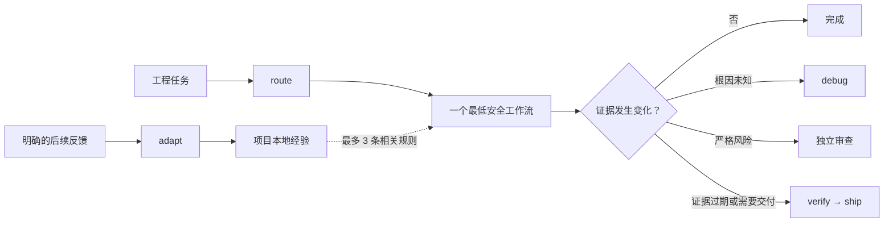

# LeanPowers

**轻量但不降级的 Agent 工程工作流**

*Essential workflows. Less ceremony.*

[English](README.md) · [与 Superpowers 对比](docs/comparison-superpowers.zh-CN.md) · [基准测试方法](docs/benchmark.md) · [致谢](ACKNOWLEDGMENTS.md) · [迁移指南](docs/migration.md)

LeanPowers 保留真正影响工程结果的约束：明确需求边界、回归证据、根因调试、独立审查、当前版本验证和安全交付；同时根据风险选择最短的安全路径。它是一个工作流微内核，不是常驻的大提示词，也不是重型编排服务。

> **发布状态：**`0.2.0` 是带动态风险路由和可选项目学习能力的技术预览版。成对 live 基准及其审计持续公开，详见[最新结果](docs/benchmarks/development-effects-performance-confirmatory-v7-2026-07-16.md)、[运行后审计](docs/benchmarks/development-effects-performance-confirmatory-v7-audit-2026-07-16.md)和[基准测试方法](docs/benchmark.md)。

> **项目谱系与致谢：**[Superpowers](https://github.com/obra/superpowers) 是这个独立项目的上游参考和最主要的工程基础。它在证据优先工程、TDD、系统化调试、审查、验证和安全交付上的实践，使 LeanPowers 成为可能。LeanPowers 探索的是另一个优化点：让完整流程按风险选择，同时保留工程严谨性。详见[致谢](ACKNOWLEDGMENTS.md)。

## 为什么是 LeanPowers

- 能从明确的后续反馈中学习，并在下一次只取回最相关的项目经验。
- 根据任务与风险动态选择一个最低安全工作流，不预加载冗长流程链。
- 六个职责清晰的工程工作流，由小型 `route` 与 `adapt` 控制 Skill 协调。
- 使用 `lean`、`standard`、`strict` 三档风险路径。
- 默认单 Agent；只有任务真正独立且可独立验证时才使用少量子 Agent。
- 宣称完成或交付前，必须有当前版本的证据。
- 安装包不需要 MCP、守护进程、遥测服务或额外安装依赖。
- Codex 与 Claude Code 都有原生插件包，同时保留通用 Agent Skills 兼容性。

## 随项目学习和进化

LeanPowers 提供可选、项目级的反馈学习闭环。后续对话明确说明上一次结果成功或失败、纠正旧结论，或者给出持久的项目偏好时，`adapt` 会把反馈压缩成一条范围尽可能小的可复用经验。之后的相关工作流会按工作流、路径和标签取回最多三条经验，把真正相关的项目上下文带入当前任务，而不需要反复加载不断增长的历史对话。

```text
为当前项目启用 LeanPowers 学习。

“之前的缓存修复失败了，原因是 tenant scope 检查得太晚。”
→ adapt 为相关代码与工作流记录一条范围明确的纠正。

“这套重试策略在线上有效，这个客户后续都保持这个约定。”
→ adapt 记录或强化一条持久项目规则。
```

新的不同支持证据会强化已有经验；明确纠正可以替代过时经验。经验支持过期时间，也可以随时检查、忘记、清空、停用或永久删除。沉默、感谢、继续对话、一次性授权和 Agent 自己的判断都不会被当作学习证据。

学习默认关闭。启用后，随包 Node.js helper 会把数据保存在当前项目的 `.leanpowers/`，并只写入 Git 本地 `info/exclude`，不会修改受版本控制的 `.gitignore`。其中只有归一化规则和有界证据摘要，不包含原始对话、完整提示词、命令日志、堆栈、密钥、凭证或无关仓库内容。

取回的经验只是建议，不能降低授权、范围、风险、根因定位、回归证据、独立审查或完成证据门槛。整个机制没有后台活动、网络访问、遥测、全局用户画像或跨项目共享；只有明确启用学习后才需要 Node.js 20+。

## 动态流程，不是固定流水线

`route` 读取任务和可观察风险后，只激活一个当前负责的工作流。只有新证据要求时才会转移：根因未知时进入 `debug`，严格风险增加独立审查，证据已过期或需要交付时先进入 `verify`，再由 `ship` 完成目标端回读。默认不会加载完整流程链。



## 从 GitHub 直接安装

仓库本身就是 Marketplace，不需要先 clone。

### Codex

```bash
codex plugin marketplace add LAwLi3tCoding/LeanPowers
codex plugin add leanpowers@leanpowers
```

Codex 使用原生 Skill 发现，不注入启动提示词。

### Claude Code

```bash
claude plugin marketplace add LAwLi3tCoding/LeanPowers
claude plugin install leanpowers@leanpowers
```

也可以在 Claude Code 交互会话中执行：

```text
/plugin marketplace add LAwLi3tCoding/LeanPowers
/plugin install leanpowers@leanpowers
```

Claude Code 只会在 `SessionStart` 注入一段精简、只读的路由说明。这个 Hook 不扫描或修改仓库，不访问网络，也不会派发 Agent。

## 快速开始

LeanPowers 可以根据任务自动选择入口，也支持显式调用。

```text
# Codex
$leanpowers:route 为这个工程任务选择最轻且安全的工作流。
$leanpowers:build mode=lean 补上缺失的参数校验和回归测试。
$leanpowers:debug 集成测试偶发返回空结果，请找出根因并修复。
$leanpowers:verify 证明当前分支可以交付。
$leanpowers:adapt 为当前项目启用 LeanPowers 学习。

# Claude Code
/leanpowers:route 为这个工程任务选择最轻且安全的工作流。
/leanpowers:shape mode=standard 设计一个向后兼容的分页改造。
/leanpowers:review 按验收标准审查当前 diff。
/leanpowers:ship 推送已验证的分支并创建用户要求的 PR。
/leanpowers:adapt 查看 LeanPowers 在当前项目学到了什么。
```

默认是 `mode=auto`。你也可以指定 `mode=lean`、`mode=standard` 或 `mode=strict`。模式是流程偏好，不能关闭安全、授权、范围和证据门槛；风险更高时会自动升级。

## 六个工程工作流分别做什么

| Skill | 使用场景 | 主要产物 |
| --- | --- | --- |
| `shape` | 需求有实质歧义，范围、架构或验收条件不清楚 | 可执行任务简报和 1–5 个交付切片 |
| `build` | 功能、已知根因修复、重构、配置或文档开发 | 已实现切片、针对性证据和剩余风险 |
| `debug` | 原因未知、间歇性或存在争议的故障 | 复现、可证伪假设、根因和修复证明 |
| `review` | 独立判断正确性、风险、兼容性和复杂度 | Findings-first 结论、严重级别和证据 |
| `verify` | 证明完成、修复、安全、可安装或可交付 | 声明到命令的证据映射和验证缺口 |
| `ship` | commit、push、PR、打包、发布或交接 | 实际目标端的版本回读证据 |

`route` 和 `adapt` 都属于控制面，不会额外增加工程阶段。`route` 决定当前做什么，`adapt` 根据明确反馈调整未来默认做法；两者让流程保持动态，又不会把学习变成新的必经仪式。

## 路由与模式

LeanPowers 每次只从一个工作流开始，出现可观察的升级条件时才跳转。

| 模式 | 典型信号 | 默认路径 |
| --- | --- | --- |
| `lean` | 清晰、局部、可逆，已有验证路径 | 当前适用证据完整时 `build → complete`；否则 `verify` |
| `standard` | 普通功能、多文件行为、有界不确定性 | 仅边界不清时 `shape(light)`，随后 `build/debug → complete`；证据不完整时 `verify` |
| `strict` | 安全（含认证、凭证/secret、密码学、签名验证）、鉴权、支付、隐私、迁移、并发、生产、不可逆操作 | 仅边界不清时 `shape(full)`，随后 `build/debug → 独立 review → complete`；仅在证据失效、明确要求验证/交付或跨产物声明时进入 `verify → ship（按需）` |

多个信号冲突时采用最高风险；无法判断时回退到 `standard`。验证失败、范围扩大、根因未知、公开边界变化或审查发现高危问题，都会升级流程。

示例：

- 有现成测试的私有方法重命名：`lean`。
- 普通多文件功能：`standard`，边界或不确定性较高时增加 `review`。
- 原因未知的生产鉴权故障：`strict`，从 `debug` 开始。
- 只要求审查：只执行 `review`，除非用户继续授权修复。
- 交付 PR：先取得当前 `verify` 证据，再由 `ship` 执行并回读远端状态。

## 轻流程不等于降低质量

以下规则在任何模式下都有效：

1. 没有当前证据，不能宣称完成。
2. 未知故障必须先定位根因，再宣称修复。
3. 行为变化必须有合适的回归证据。
4. 不超出用户声明的范围。
5. 高风险变更必须独立审查。
6. 破坏性、不可逆、凭证相关或生产操作必须获得授权。
7. 新证据推翻旧结论时必须重新判断。
8. 所有重要验证缺口都要明确报告。

证据与版本和作用范围绑定。未受影响的证据可以复用；代码、配置、依赖、生成物或环境变化后，只失效受影响的部分。

## 不同运行时的行为

| 能力 | Codex | Claude Code | 其他 Agent Skills 运行时 |
| --- | --- | --- | --- |
| 六个工程工作流 + `route`/`adapt` 控制 Skill | 支持 | 支持 | 支持 |
| 启动注入 | 无 | 精简路由说明 | 默认无 |
| reviewer / verifier | 运行时原生任务提示 | 随包 Agent | 单 Agent 执行；严格审查必须来自外部独立视角 |
| 核心质量门槛 | 保留 | 保留 | 保留 |

Codex 保持零启动注入，通过原生 metadata 发现 499 词的 `route` Skill。Claude Code 接收一段 111 词的只读路由提示，并在启动、清空或上下文压缩后恢复；它不会检查 `.leanpowers/`、扫描或修改仓库、访问网络或派发 Agent。六个工程工作流不需要 Node.js；只有用户明确启用项目学习后，可选学习 helper 才需要 Node.js 20+。

## 隐私与安全

- 不包含遥测或分析上报。
- Claude 启动 Hook 不扫描仓库、不访问网络。
- 学习默认关闭，启用后的数据也不会离开当前项目。
- 只保存归一化规则和有界证据摘要，不保存原始对话、密钥、环境变量值或完整日志。
- 完整命令输出保留在本地，只把有界摘要放进模型上下文。

Agent 指令本身不是安全边界。授权破坏性、生产或凭证相关操作前，请检查命令和 diff。详见 [SECURITY.md](SECURITY.md)。

## 与 Superpowers 6.1.1 的区别

LeanPowers 延续 Superpowers 证据优先的工程原则，把 13 个工程流程关注点收敛为六个按风险启用的工作流。六个工程 `SKILL.md` 共 3,039 词，比 Superpowers 6.1.1 的 14 文件对比集减少 83.6%；加上 `route`（499 词）和 `adapt`（329 词）后，全部八个 LeanPowers Skill 共 3,867 词，仍减少 79.1%。

这是一份谱系与取舍对比，不是胜负排名。Superpowers 仍是 LeanPowers 的上游灵感来源和完整工作流参考；LeanPowers 要验证的是：能否用更小、按风险自适应的控制面保留影响工程结果的关键保障。保留能力、不同优化选择、证据边界和完整结论见[中文对比文档](docs/comparison-superpowers.zh-CN.md)。迁移前请先读 [docs/migration.md](docs/migration.md)：**不要在同一会话同时启用两个系统的自动路由。**

## 证据与基准

LeanPowers 持续公开成对 live 编程测试、预注册、运行后审计和可复现的比较器。结构缩减已经验证；真实开发效果仍属于有边界的证据，不能概括为普遍等效或全面更快。具体分数、限制和所有冻结历史结论都保留在基准文档中，不再挤占产品首页。

比较器接收符合 [schemas/benchmark-result.schema.json](schemas/benchmark-result.schema.json) 的成对结果：

```bash
node scripts/benchmark.mjs compare \
  --baseline path/to/superpowers-live.json \
  --candidate path/to/leanpowers-live.json \
  --out path/to/report
```

只有完整、live、盲评且条件完全配对的结果才可能通过发布门槛。完整证据见[基准方法与当前状态](docs/benchmark.md)、[最新 v7 结果](docs/benchmarks/development-effects-performance-confirmatory-v7-2026-07-16.md)、[v7 运行后审计](docs/benchmarks/development-effects-performance-confirmatory-v7-audit-2026-07-16.md)和[与 Superpowers 的完整对比](docs/comparison-superpowers.zh-CN.md)。

## 开发

开发需要 Git 和 Node.js 20 或 22。安装后的工程工作流没有运行时依赖；只有用户明确启用项目学习时才使用 Node.js 20+。

```bash
npm run generate         # 重新生成两个运行时安装包
npm run generate:check   # 检查生成物是否漂移
npm test                 # 运行 Node 测试
npm run validate         # 校验同步、结构、预算和测试
npm run build            # 在 dist/ 生成已验证的发布产物
```

`metadata/`、`skills/`、`references/`、`agent-specs/` 和 `adapters/` 是规范源。不要手工修改 `plugins/`，应运行生成器。贡献规则见 [CONTRIBUTING.md](CONTRIBUTING.md)。

## 许可证

[MIT](LICENSE)
