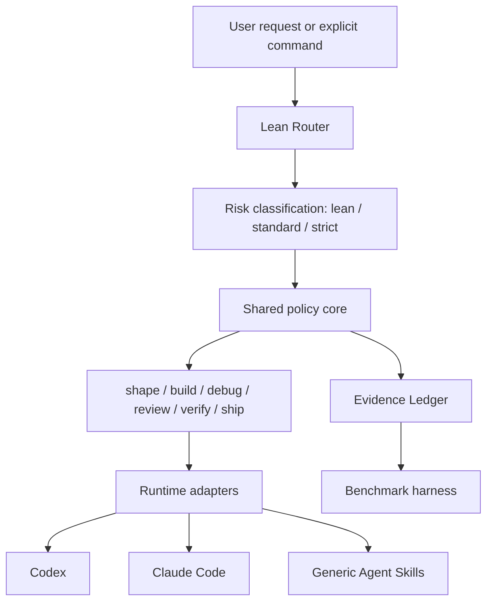

# LeanPowers Design

- Status: Approved
- Date: 2026-07-13
- Plugin ID: `leanpowers`
- Positioning: 轻量但不降级的 Agent 工程工作流
- Tagline: *Essential workflows. Less ceremony.*

## 1. Executive decision

LeanPowers is a workflow microkernel for Codex and Claude Code. It preserves the engineering safeguards of Superpowers while replacing fixed, serial ceremony with risk-triggered quality gates.

The product architecture is:

```text
shared workflow core
  + six orthogonal skills
  + adaptive risk policy
  + Codex and Claude Code adapters
  + evidence-aware verification
  + non-inferiority benchmarks
```

LeanPowers does not promise identical process traces to Superpowers. It promises comparable engineering outcomes with materially lower workflow overhead.

## 2. Goals

1. Preserve requirements shaping, regression evidence, root-cause debugging, independent review, verification, and safe delivery.
2. Reduce the core workflow library from 14 Superpowers skills to six LeanPowers skills.
3. Avoid mandatory design documents, section-by-section approvals, micro-task review, and repeated full verification for low- and medium-risk work.
4. Treat Codex and Claude Code as first-class runtimes while using Agent Skills as the portable core.
5. Prove quality through paired benchmarks rather than subjective workflow similarity.
6. Keep the installed runtime static and dependency-free; Node.js is development tooling only.

## 3. Non-goals

- No mandatory MCP server.
- No daemon or long-running workflow service.
- No mandatory worktree for every feature.
- No recursive multi-agent requirement.
- No fixed implementer-plus-reviewer pair for every micro-task.
- No large always-on system prompt.
- No weaker reviewer model as a cost-saving strategy.
- No attempt to make runtime-specific plugin manifests or subagent definitions identical.

## 4. Product principles

1. **Risk over ritual:** quality gates are triggered by risk, not by task labels.
2. **Evidence over ceremony:** completion claims require evidence, not a prescribed performance of process.
3. **One core, native adapters:** workflow semantics are shared; runtime integration is native.
4. **Progressive disclosure:** only the active skill and required references enter context.
5. **Strong judgment, fewer calls:** reduce turns, context, and dispatch count rather than model quality.
6. **Autonomy by default:** clear, local, reversible work proceeds without permission handoffs.

## 5. Architecture



### 5.1 Lean Router

The router identifies the initial workflow and the lowest safe risk level. It is not a seventh user-facing skill. Routing is expressed through precise skill descriptions, a compact shared risk policy, and a small Claude Code startup charter.

### 5.2 Shared policy core

The policy core defines risk signals, hard quality invariants, workflow transitions, evidence validity, subagent limits, and stop or escalation conditions.

### 5.3 Runtime adapters

Skills are shared directly. Plugin manifests, marketplaces, hooks, invocation syntax, and packaged subagents are runtime-specific generated artifacts.

### 5.4 Evidence Ledger

The ledger records which verification evidence remains valid for a revision fingerprint. It reduces redundant verification without allowing stale evidence to support a completion claim.

### 5.5 Benchmark harness

The harness compares LeanPowers with Superpowers using identical model, repository snapshot, prompt, and evaluator conditions.

## 6. Risk model

LeanPowers uses the highest applicable risk signal rather than a numerical score.

### 6.1 Lean

Use for clear, local, reversible changes with an established validation path and no public API, security, data, or production implications.

Default flow:

```text
build -> verify
```

### 6.2 Standard

Use for normal features, multi-file behavior changes, ordinary defects, bounded dependency changes, or work with a small amount of design uncertainty.

Default flow:

```text
shape(light) -> build/debug -> verify
```

Review is added when the change boundary or uncertainty warrants it.

### 6.3 Strict

Use for security, authorization, payment, privacy, migration, concurrency, production, irreversible operations, large refactors, or severe unknown-cause failures.

Default flow:

```text
shape(full) -> build/debug -> review -> verify -> ship
```

### 6.4 Upgrade signals

- Material ambiguity in requirements or acceptance criteria.
- Public API, data model, permission, security, or compatibility changes.
- Cross-module, cross-repository, or external-system impact.
- Irreversible or production state changes.
- Missing validation path or failed verification.
- A larger blast radius than initially assessed.
- High or critical review findings.

User preference can increase rigor. It cannot disable safety, authorization, scope, or evidence requirements.

## 7. Core skills

### 7.1 `shape`

Purpose: turn a request into an executable, bounded unit of work.

Minimal output:

```yaml
goal: desired outcome
scope: modification boundary
acceptance: completion evidence
constraints: hard requirements
risk: lean | standard | strict
slices: 1-5 independently verifiable delivery slices
```

Rules:

- Inspect the repository before asking repository-answerable questions.
- Do not repeat information already supplied.
- Use at most one consolidated clarification round for ordinary work.
- Plans describe boundaries, interfaces, acceptance, and validation rather than copying full implementation code.
- Persist a design only for complex, cross-session, or explicitly documented work.
- Pause only for material ambiguity, irreversible decisions, missing authority, or production impact.

### 7.2 `build`

Purpose: implement code, configuration, or documentation changes.

Loop:

```text
read goal and boundaries
-> establish validation baseline
-> implement one delivery slice
-> run targeted validation
-> continue
```

Rules:

- Behavior changes require regression evidence.
- Use RED-GREEN when TDD is appropriate.
- Generated files, configuration, and exploratory prototypes use the most appropriate verification strategy rather than mechanical unit-test requirements.
- Default to one agent.
- Parallelize only two or more independent and independently verifiable tasks without shared write conflicts.
- Default to two or three direct child agents at most and do not depend on recursive delegation.

### 7.3 `debug`

Purpose: diagnose and repair failures whose cause is unknown.

State machine:

```text
reproduce -> collect evidence -> form one falsifiable hypothesis
-> run the smallest experiment -> identify root cause
-> apply the smallest root-cause fix -> regression verification
```

Rules:

- Maintain one primary unverified hypothesis at a time.
- Do not hide an unknown cause with defensive code.
- Cover the real failure path with regression evidence.
- Return to evidence gathering when new facts invalidate the hypothesis.

### 7.4 `review`

Purpose: provide an independent judgment of specification compliance and code quality.

Output contract:

```yaml
verdict: pass | changes_required
findings:
  - severity: critical | high | medium | low
    location: file:line
    evidence: concrete evidence
    impact: why it matters
    repair: smallest safe repair direction
```

Strict tasks require an independent review perspective. Standard tasks use review according to boundary and uncertainty. Lean tasks do not start a reviewer by default.

### 7.5 `verify`

Purpose: prove completion claims with current evidence.

Order:

```text
targeted tests
-> lint / typecheck / static analysis
-> necessary integration tests
-> necessary full suite
-> inspect output
-> record evidence
```

Valid full-suite evidence may be reused for the same revision fingerprint. Subsequent changes invalidate only affected evidence.

### 7.6 `ship`

Purpose: deliver verified work through the requested repository or release path.

Responsibilities:

- Inspect worktree and branch state.
- Create a branch or worktree when isolation is needed.
- Structure commits.
- Push, open a pull request, merge, or package only when requested.
- Read back the remote state and report the actual delivered target.

Explicit user delivery intent is executed directly. Destructive Git operations, production deployment, and irreversible actions still require authority.

## 8. Hard quality invariants

These invariants are always active:

1. Do not claim completion without valid evidence.
2. Unknown-cause failures use root-cause debugging before repair claims.
3. Behavior changes require appropriate regression evidence.
4. Stay within the user's declared scope.
5. High-risk changes require an independent review.
6. Destructive, irreversible, or production operations require authorization.
7. Re-evaluate when new evidence invalidates an earlier conclusion.
8. Explicitly report validation gaps.

## 9. Workflow examples

| Task | Default workflow |
| --- | --- |
| Small explicit change | `build -> verify` |
| Normal feature | `shape(light) -> build -> verify` |
| Complex feature | `shape(full) -> build -> review -> verify` |
| Unknown defect | `debug -> verify` |
| Large root-cause repair | `debug -> build -> review -> verify` |
| Review-only request | `review` |
| Pull request delivery | `verify -> ship` |
| High-risk release | `shape -> build -> review -> verify -> ship` |

Explicit invocation uses `$leanpowers:<skill>` in Codex and `/leanpowers:<skill>` in Claude Code. `mode=auto`, `mode=lean`, `mode=standard`, and `mode=strict` are accepted workflow preferences. The default is `auto`.

## 10. Runtime adapters

### 10.1 Shared

- Six standard Agent Skills.
- Skill frontmatter uses only the cross-runtime `name` and `description` fields.
- Risk policy and hard quality gates.
- Evidence and subagent protocols.
- Canonical reviewer and verifier semantics.
- Benchmark scenarios and scoring.

### 10.2 Codex

- `.codex-plugin/plugin.json`.
- Native skill discovery.
- No startup hook injection by default.
- Runtime-native child-agent task prompts.
- Optional generated `.codex/agents/*.toml` templates; the core does not require their installation.

### 10.3 Claude Code

- `.claude-plugin/plugin.json`.
- Optional packaged reviewer and verifier agents.
- A command-only SessionStart charter of no more than 200 words.
- No prompt or agent hooks for orchestration.
- Skills remain the primary workflow mechanism.

### 10.4 Other Agent Skills runtimes

- Standard skills only.
- Single-agent fallback.
- No guarantee of hooks or custom subagents.
- Hard quality rules remain applicable.

## 11. Hook policy

V1 permits one Claude Code SessionStart command hook. It provides a compact routing charter only. It does not scan repositories, access the network, write the workspace, dispatch agents, or force workflow transitions.

Codex uses no startup hook. Any hook failure must leave the skills fully usable.

## 12. Subagent policy

Parallel work requires all of the following:

- Two or more genuinely independent tasks.
- Independent validation.
- No shared-file write conflict.
- Material latency or quality benefit.

Defaults:

- Lean: zero child agents.
- Standard: zero to two.
- Complex: usually no more than three.
- One direct level only.
- Reviewer and implementer perspectives remain independent.
- Child output is limited to conclusions, changed files, evidence, and blockers.

V1 defines two stable optional roles: reviewer and verifier. Implementers receive task-specific briefs rather than a large static role prompt.

## 13. Evidence Ledger

Schema:

```yaml
revision_fingerprint: repository revision and relevant dirty-worktree digest
command: executed verification command
scope: claim supported by the command
result: pass | fail | unavailable
exit_code: integer or null
timestamp: ISO-8601 timestamp
summary: bounded result summary
```

Storage:

- Lean and ordinary standard work keeps an ephemeral in-context ledger.
- Strict or cross-session work may persist evidence in runtime plugin data, keyed by repository and revision fingerprint.
- No repository-local state is created by default.
- Secrets, environment variables, and full logs are not stored.
- Full output remains local; only bounded summaries enter model context.
- Persistent records expire after 30 days.

## 14. Repository design

```text
LeanPowers/
├── .claude-plugin/marketplace.json
├── .agents/plugins/marketplace.json
├── references/
│   ├── risk-policy.md
│   ├── quality-gates.md
│   ├── evidence-protocol.md
│   └── subagent-policy.md
├── skills/
│   ├── shape/SKILL.md
│   ├── build/SKILL.md
│   ├── debug/SKILL.md
│   ├── review/SKILL.md
│   ├── verify/SKILL.md
│   └── ship/SKILL.md
├── agent-specs/
│   ├── reviewer.md
│   └── verifier.md
├── agents/
│   ├── reviewer.md
│   └── verifier.md
├── adapters/
│   ├── codex/agents/
│   └── claude/hooks.json
├── hooks/
│   ├── hooks.json
│   └── session-start
├── metadata/plugin.json
├── plugins/                       # generated, committed installable packages
│   ├── codex/leanpowers/
│   │   ├── .codex-plugin/plugin.json
│   │   └── skills/
│   └── claude/leanpowers/
│       ├── .claude-plugin/plugin.json
│       ├── skills/
│       ├── agents/
│       └── hooks/
├── scripts/
├── schemas/
├── evals/
├── tests/
├── docs/
├── README.md
├── README.zh-CN.md
├── LICENSE
└── package.json
```

`metadata/plugin.json` is the single metadata source. JSON keeps the generator dependency-free while development scripts produce two committed installable packages, their runtime manifests, marketplace entries, and optional agent artifacts. Package-sync tests prevent generated copies from drifting from the canonical skills. The installed workflow remains static and dependency-free.

## 15. Token and performance budgets

| Item | Target |
| --- | ---: |
| Core skills | 6 |
| Each `SKILL.md` | <= 800 words |
| Total `SKILL.md` text | <= 5,000 words |
| Claude startup charter | <= 200 words |
| Codex startup injection | 0 |
| Child-agent brief | <= 350 words |
| Typical child result | <= 500 words |
| Standard plan | 1-5 delivery slices |

Behavior budgets:

- Zero child agents for low-risk work.
- Usually zero to two for standard work.
- Usually no more than three to five total dispatches for strict work.
- Zero or one consolidated clarification round for standard work.
- At most two material decision gates for strict work.
- One full-suite execution per unchanged revision in the normal case.

## 16. Comparison with Superpowers 6.1.1

The local Superpowers 6.1.1 installation contains 14 skills and 18,516 words of primary `SKILL.md` text. Its principal cost drivers are broad mandatory routing, serial approval gates, micro-task planning, per-task implementer and reviewer dispatch, and repeated completion verification.

| Dimension | Superpowers | LeanPowers |
| --- | --- | --- |
| Core skills | 14 | 6 |
| Primary skill text | 18,516 words | target <= 5,000 words |
| Workflow selection | broad skill mandate | risk-adaptive minimum safe path |
| Creative changes | mandatory brainstorm and approval chain | shaping only when risk or ambiguity requires it |
| Planning | 2-5 minute micro-steps, often with code | 1-5 delivery slices focused on interfaces and evidence |
| TDD | separate long workflow | invariant within `build` |
| Debugging | systematic root-cause workflow | retained as compact state machine |
| Agent dispatch | per-task implementer and reviewer, then final review | default single agent; dispatch by independent delivery boundary |
| Review | micro-task and final review | risk-boundary review; strict retains independent final review |
| Verification | fresh proof frequently repeated | revision-keyed evidence with targeted invalidation |
| Worktrees | common default for feature work | conditional on branch, dirtiness, and conflict risk |
| Completion menu | fixed options | follow explicit delivery intent |
| Claude bootstrap | about 481 words | <= 200 words |
| Codex bootstrap | 0 in current package | 0 |
| Visual brainstorming | bundled companion | optional future package |
| Skill authoring | large core skill | optional future package |

LeanPowers retains root-cause analysis, regression evidence, independent review, completion proof, isolation safety, and context handoff. It removes or compresses repeated warnings, automatic ceremony, micro-task dispatch, duplicated implementation in plans, and unchanged-revision revalidation.

## 17. Non-inferiority benchmark

The benchmark uses identical model, repository snapshot, prompt, and evaluator conditions for Superpowers 6.1.1 and LeanPowers. It includes multiple seeds, blind evaluation, and seeded defects.

Scenario classes:

1. Small explicit feature.
2. Multi-file feature.
3. Known-cause defect.
4. Unknown-cause defect.
5. Configuration or build change.
6. API compatibility change.
7. Security, authorization, and data-risk work.
8. Review-only task.
9. Dirty-worktree and pull-request delivery.
10. Mutation cases with planted defects.

Quality metrics:

- Requirement satisfaction.
- Test and build correctness.
- Seeded-defect detection.
- Introduced regression rate.
- Scope violation rate.
- False completion claims.
- Unauthorized high-risk actions.
- Review severity accuracy.

Cost metrics:

- Input and output tokens.
- Workflow-only tokens.
- Wall-clock time.
- Child-agent calls.
- User round trips.
- Duplicate commands and repeated validation.

Release gates:

- Overall task success is within three percentage points of Superpowers.
- Composite quality passes a five-percent non-inferiority margin.
- No additional critical seeded-defect escape.
- Regression and scope-violation rates are no more than two percentage points worse.
- Standard-task median tokens are reduced by at least 50%.
- Standard-task median wall time is reduced by at least 40%.
- Median agent calls are reduced by at least 60%.
- Strict tasks prioritize quality even when savings are smaller.
- Any regressing scenario category routes to a stricter fallback before release.

## 18. Failure and fallback behavior

| Failure | Fallback |
| --- | --- |
| Risk cannot be classified | use `standard` |
| Security or irreversible signal | upgrade to `strict` |
| Child agents unavailable | single-agent execution |
| Hook failure | skills continue independently |
| Evidence state invalid | discard and re-run validation |
| Test command unavailable | inspect project guidance, then report the gap explicitly |
| Review conflicts with implementation | resolve from code and experiments |
| Runtime feature unsupported | standard Agent Skills behavior |
| Benchmark category regresses | strict fallback for that category |

## 19. Security and privacy

- No telemetry by default.
- No default network access.
- No code, logs, or benchmark data upload.
- Hook scripts do not scan or modify repositories.
- Evidence does not capture credentials or environment variables.
- Production, destructive, and irreversible operations remain authority-gated.
- Generated hooks and manifests receive static validation.

## 20. Distribution and migration

One GitHub repository publishes Codex and Claude Code marketplace entries with a shared version and Git tag. Each marketplace points to its runtime-specific generated package under `plugins/`, and both packages are generated from one metadata and skill source. This prevents Claude-only hooks from being discovered by Codex while keeping installation static.

Coexistence with Superpowers is supported for explicit namespaced invocation. Automatic routing should not be enabled in both simultaneously because the Superpowers startup directive can dominate routing. Migration maps the existing skills as follows:

```text
brainstorming + writing-plans -> shape
TDD + executing-plans + SDD + parallel agents -> build
systematic-debugging -> debug
requesting-review + receiving-review -> review
verification-before-completion -> verify
worktrees + finishing-a-branch -> ship
```

## 21. Release stages

### 0.1.0: Core loop

- Six skills.
- Risk and quality policies.
- Codex and Claude manifests.
- Basic compatibility tests.
- English and Chinese documentation.

### 0.2.0: Native adapters

- Compact Claude startup charter.
- Reviewer and verifier agents.
- Optional Codex agent templates.
- Evidence Ledger.
- Dual-marketplace packaging.

### 0.3.0: Quality proof

- Paired Superpowers benchmark.
- Mutation cases.
- Token, latency, and dispatch metrics.
- Strict fallback.

### 1.0.0: Stable release

Release only after non-inferiority and efficiency gates pass.

Optional future packages may provide authoring, visual brainstorming, large-team orchestration, or frontend-specific workflows. They do not enter the core plugin.

## 22. V1 acceptance criteria

1. Codex and Claude Code packages both install and validate.
2. All six skills support automatic and explicit invocation.
3. Lean, standard, and strict routing has automated coverage.
4. Both runtime outputs derive from one metadata and workflow core.
5. Basic runtime use requires no Node.js, MCP, or daemon.
6. Hook and subagent unavailability degrade safely.
7. Completion claims follow the verification contract.
8. The benchmark meets non-inferiority gates.
9. Efficiency targets are measured and met.
10. Architecture, comparison, migration, benchmark, and bilingual usage documentation is complete.
11. Packaged artifacts are validated outside the source checkout.

## 23. Final product distinction

```text
Superpowers: every step passes through a fixed quality process.
LeanPowers: every material risk passes through the necessary quality gate.
```

This is the basis for *Essential workflows. Less ceremony.*
